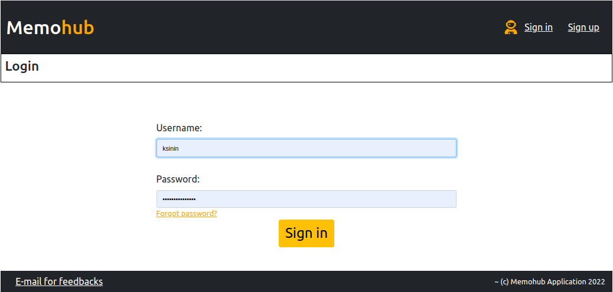
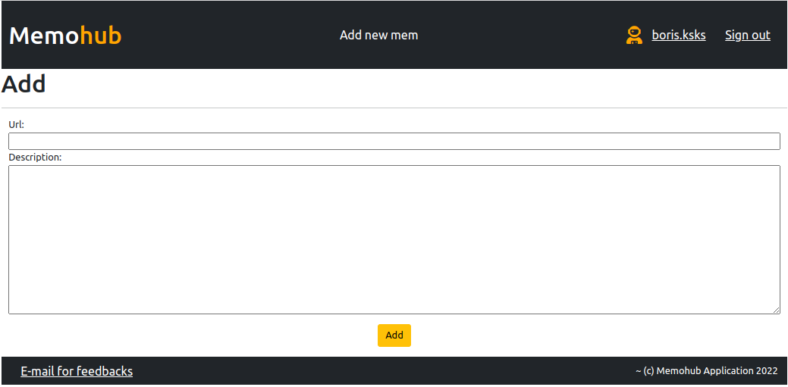
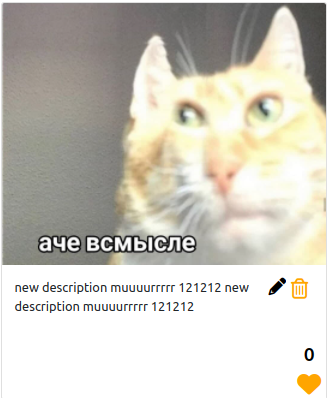
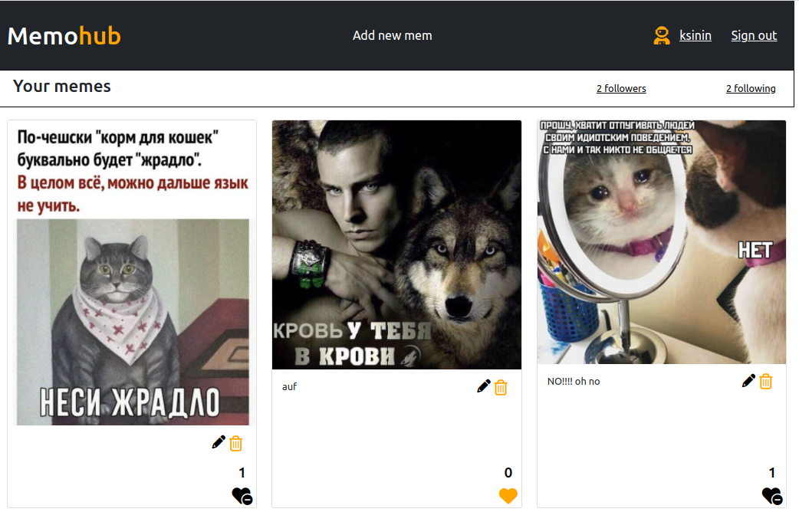
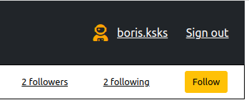
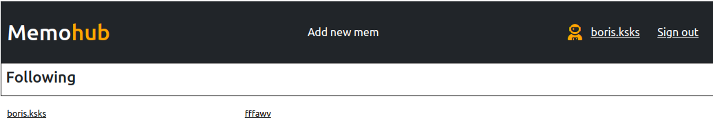
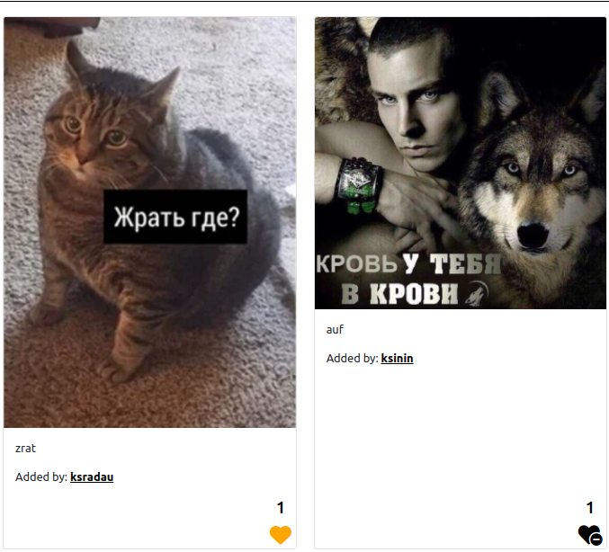
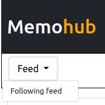

# memohub

### Place where you can store your memes.

### Commands:
- `make up` - Start project
- `make stop` - Stop project
- `make cs` - Create superuser
- ... *list of all available commands you can see in `Makefile`*

### Built with:
- `Django framework`
- `PostgreSQL`

# memohub includes:

## Registration, login and logout:
* 
* 
## Adding memes by adding a link with the ability to add a description:
* 
## Editing description and deleting mem:
* 
## User profile:
* 
## Subscriptions and subscribers system:
* 
* 
## Like/ unlike system:
* 
## User feed options:
* 

<h1>Please enjoy it =)</h1>

